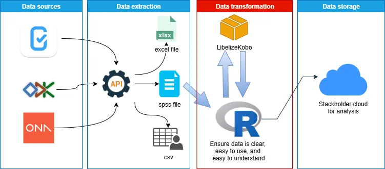

[lien vers le repos](https://github.com/abouattara/labelizeKobo)

VERSION / ENG
---

## 📦 Package to Label KoboToolbox, ODK, or ONA Data Using `.sps` Files

This repository contains all the resources developed to apply labels to survey data collected via **KoboToolbox**, **ODK**, or **ONA** using label files in `.sps` (SPSS syntax) format.

It facilitates the transformation of raw, coded datasets into human-readable formats by automatically assigning variable names and value labels. This makes the data easier to interpret, even for users unfamiliar with the original questionnaire.

**🧩 Package name:** `labelizeKobo`

Easily apply SPSS (`.sps`) labels to KoboToolbox, ODK, or ONA data in **R**.

### Installation and usage

```r
remotes::install_github("https://github.com/abouattara/labelizeKobo/labelizeKobo")

library(labelizeKobo)

data <- readxl::read_xlsx("my_data.xlsx")
labelled_data <- labelize_my_data(data, "labels.sps")

View(labelled_data)
haven::write_dta(data_xls, paste0(getwd(),"/my_data.dta"))
```


VERSION / FR
---

## 📦 Package pour **labelliser** vos données brutes (KoboToolbox, ODK, ONA) à partir d’un fichier `.sps`

Ce dépôt contient toutes les ressources nécessaires développées pour **labelliser** les données d’enquêtes collectées via **KoboToolbox**, **ODK** ou **ONA**, à l’aide d’un fichier de labels au format `.sps` (syntaxe SPSS).

Cela facilite la transformation des données codifiées en un format lisible et interprétable, même par des utilisateurs sans connaissance du questionnaire initial. Les noms de variables et les modalités sont automatiquement associés à leurs libellés.

**🧩 Nom du package :** `labelizeKobo`

Appliquez facilement les labels issus d’un fichier SPSS (`.sps`) à vos données KoboToolbox, ODK ou ONA dans **R**.

### Installation et utilisation

```r
remotes::install_github("https://github.com/abouattara/labelizeKobo/labelizeKobo")

library(labelizeKobo)

data <- readxl::read_xlsx("my_data.xlsx")
labelled_data <- labelize_my_data(data, "labels.sps")

View(labelled_data)
haven::write_dta(data_xls, paste0(getwd(),"/my_data.dta"))
```
